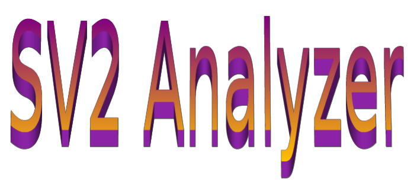

# SV2 Analyzer: Open-Source Large Language Model-Based Framework for Accelerating Digital Circuits Verification Flow
This repository contains the source code for:

<a href = "https://ieeexplore.ieee.org/document/11602718">M. Khaled, "SV2 Analyzer: Open-Source Large Language Model-Based Framework for Accelerating Digital Circuits Verification Flow," 2026 IEEE International Conference on Smart Sustainable Systems for Computer and Engineering Applications (3SCEA), Cairo, Egypt, 2026, pp. 374-379, doi: 10.1109/3SCEA68071.2026.11602718. </a>

**Don't forget to give a star and/or cite if you find the project useful to you**

Project is welcoming contributions that may include:

- Modifying the backend
- Fine-tuning the models
- Enriching the RAG Database

